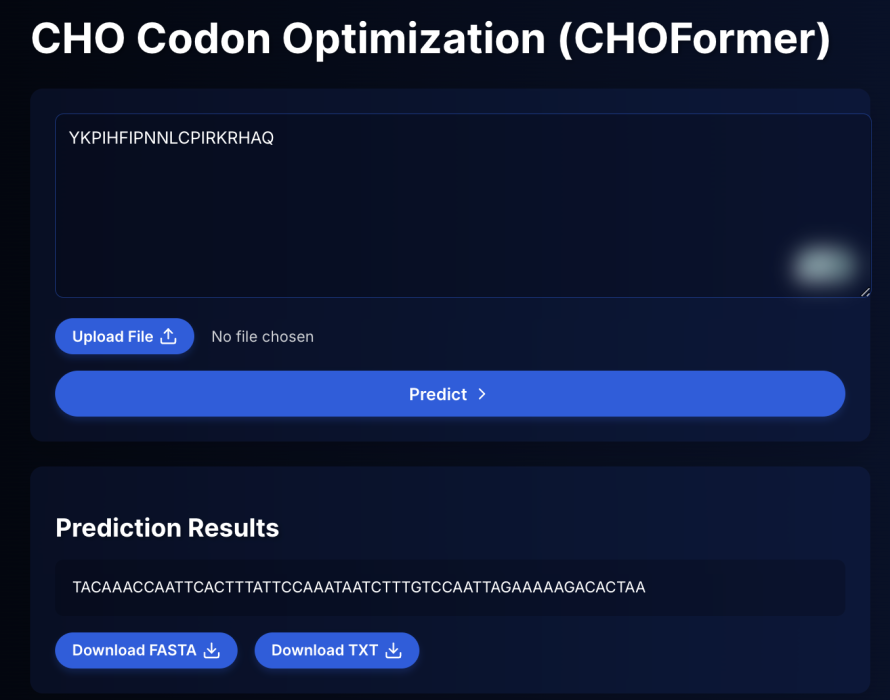
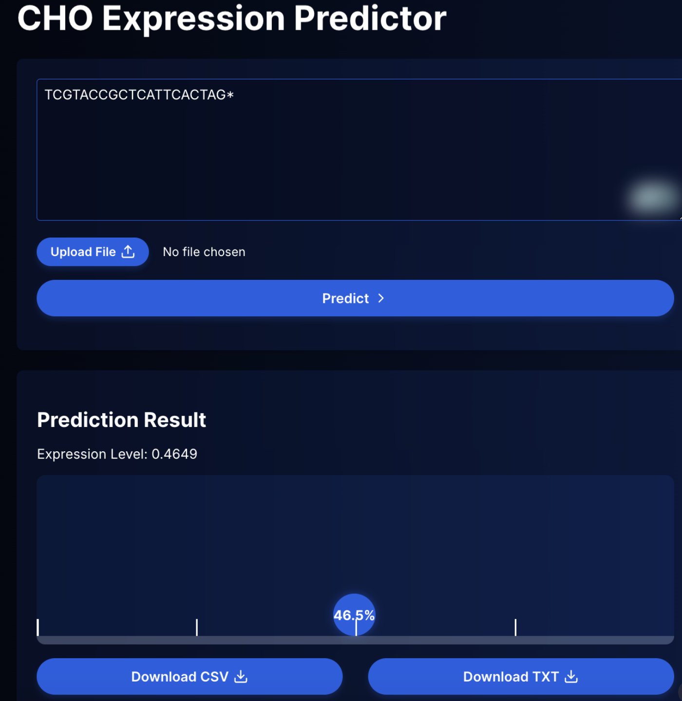

<!--  -->

# CHOFormer: Optimizing Protein Expression in CHO Cells

<!--  -->

- ### <h3> <a href="#about">About</a></h3>
- ### <h3> <a href="#usetool">How To Use This Tool</a> </h3>
- ### <h3> <a href="#benchmark">Benchmarking</a> </h3>
- ### <h3> <a href="#training">Training and Data Preprocessing</a> </h3>
- ### <h3> <a href="#license">License</a> </h3>

## <h2 id="about">Motivation and Inspiration</a> </h2>
We are a team of passionate undergraduate and high school students. We come from a really diverse set of backgrounds ranging from protein ML to comp neuro research! We are very interested in working on problems orthogonal to drug design. In R.J.'s drug design class at MIT, he learned about the importance of manufacturing. Manufacturing has untapped potential for AI disruption, and from our love of biology, we were interested in investigating the basis of the genetic code's degeneracy. Putting these two together, we worked on codon optimization for CHO recombinant expression systems.

## <h2 id="about">About</a> </h2>
The genetic code is degenerate; there are 61 sense codons encoding for only 20 standard amino acids. While synonymous codons encode the same amino acid, their selection can drastically influence the **speed and accuracy** of protein production: up to 1000x (Welch et al). Chinese Hamster Ovary (CHO) cells are responsible for producing nearly 70% of recombinant pharmaceuticals, such as monoclonal antibodies and therapeutic proteins. However, low protein yields in these cells pose a major challenge, often delaying the drug manufacturing process. To address these challenges, we present CHOFormer, a cutting-edge generative model that produces optimized codon sequences for **improved protein expression in CHO cells**. Specifically, we build encoder-decoder and decoder-only models to optimize codon selection solely based on information-rich protein sequence embeddings. With CHOFormer, we observe a mean Codon Adaptation Index (CAI) of 0.847, indicating that CHOFormer-generated codon sequences are highly adapted for efficient translation in CHO cells. Overall, CHOFormer is a computational pipeline that revolutionizes the codon optimization process, improving translation efficiency significantly.

<!-- CHOFormer is a state-of-the-art **transformer decoder model** designed to optimize codon sequences for enhanced protein expression in Chinese Hamster Ovary (CHO) cells. Today, nearly 70% of recombinant pharmaceuticals are manufactured using the CHO genome in their research and development. This tool addresses the challenge of low recombinant protein yields in CHO cells, critical for drug manufacturing, particularly in the development of monoclonal antibodies and other therapeutic proteins. -->

<!-- Codon optimization, currently time-consuming in laboratory environments, is significantly expedited by using CHOFormer, potentially shortening the optimization timeline from **months to minutes**. -->

## <h2 id="usetool">How To Use This Tool</a> </h2>
    

Our [website](https://choformer.com) allows for the easy usage of the tool.
For **CHOFormer**, simply input the protein sequence and the optimized DNA sequence will be outputted—it can be downloaded as a FASTA or copied directly.

For **CHOExp**, upload or paste the DNA sequence; the output will be the protein expression (normalized between 0 and 1).

## <h2 id="benchmark">Evaluation</a> </h2>

The Codon Adaptation Index (CAI) is a key metric used to predict gene expression efficiency based on codon usage, strongly correlating with real-world protein expression levels (dos Reis et al.). Similarly, the Translational Adaptation Index (TAI) measures how efficiently a sequence can be translated into protein, offering insights into translational efficiency. By applying Anwar et al.'s (2023) methodology for protein abundance prediction, we observed significant improvements after CHOFormer optimization.

    
    

The mean CAI of the optimized sequences was 0.8471 (± 0.0874), compared to the original mean CAI of 0.6541 (± 0.0526). Likewise, the mean TAI of the optimized sequences was 0.682 (± 0.209), compared to the original TAI of 0.373 (± 0.112). These results demonstrate substantial improvements in gene expression efficiency and translation potential using CHOFormer.

## <h2 id="training">Data Curation and Training Implementation</a> </h2>
### CHOFormer
We accessed a dataset of 97,000 CHO gene sequences from the NCBI database, focusing exclusively on protein-coding genes. These sequences are then filtered to retain those between 300 and 8000 base pairs, resulting in a refined dataset of 86,632 sequences. To reduce redundancy, `cd-hit-est` is employed to cluster the sequences based on an 8-word window and 90% nucleotide similarity, producing 47,713 sequences. The nucleotide sequences are then translated into their corresponding amino acid sequences, and any unnatural amino acids are removed to ensure biological relevance. The dataset is then split into training, validation, and test sets in an 80-10-10 ratio.

CHOFormer is built on the Transformer architecture, utilizing multiple decoder layers to map `ESM-2-150M` protein sequence embeddings to optimized codon sequences. To bridge the gap between amino acids and codon usage, we engineered a custom 3-mer tokenizer specifically for DNA sequences to accurately represent all codons.

To generate optimized codons, we project the ESM-2 embeddings into a higher-dimensional space before passing them through two decoder layers with four attention heads. Then, decoder logits are mapped to a probability distribution over our custom tokenizer's vocabulary to select optimized codons. With this approach, we generate DNA sequences with significantly improved protein yield and translational efficiency.

### CHOExp (CHO Expression Predictor)
CHOExp begins by accessing a dataset of 26,795 genes with corresponding RNA expression values. Genes with zero expression are removed, and the top 66% of genes that fall within three standard deviations are retained, resulting in a refined set of 13,253 genes. Expression values are then projected onto a log scale and normalized between 0 and 1 to allow sigmoid-based predictions. This dataset is split into training, validation, and test sets with an 80-10-10 split.

The core of CHOExp is an encoder-only transformer model with a dimensionality of 384, 8 layers, and 4 attention heads. The model is trained to predict protein expression levels based on the RNA expression data from the training set. CHOExp does not use any DNA foundation models as it's base, taking in the raw one-hot encoded vocab indices as input. Each DNA sequence is truncated/padded to a length of 1024 3-mer tokens (3072 total base pairs), and a classifier token <CLS> is a added at the start of the sequence. This input is processed through the transformer's attention and MLP processes. The output embedding of the <CLS> token is selected and processed through to a classification head, which consists of a linear layer and sigmoid activation function. After training the model on the training dataset for 10 epochs (including validation after every epoch), the expression model was evaluated on the test set and used to filter for high-expression CHO Genes when training CHOFormer.

## <h2 id="license">License and Credits</a> </h2>
This was developed by:
1. Rishab Jain*
2. Shrey Goel*
3. Vishrut Thoutam*
4. Balaji Rama
5. Darsh Mandera
6. Dhruv Ramu
7. Tyler Rose
8. Benjamin Chen

*These authors contributed equally

This project is licensed under the MIT License, which allows for open use, modification, and distribution. For more details, please refer to the [LICENSE](LICENSE) file.

