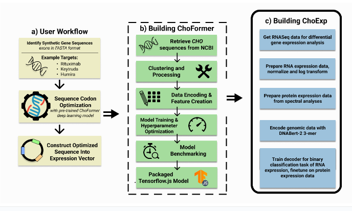
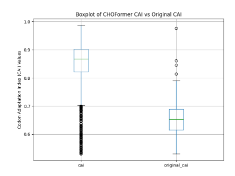
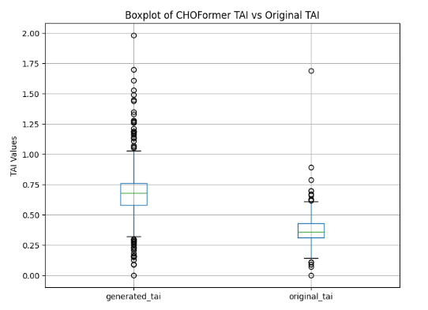

<!--  -->

# CHOFormer: Optimizing Protein Expression in CHO Cells

<!--  -->

- ### <h3> <a href="#about">About</a></h3>
- ### <h3> <a href="#usetool">How To Use This Tool</a> </h3>
- ### <h3> <a href="#benchmark">Benchmarking</a> </h3>
- ### <h3> <a href="#training">Training and Data Preprocessing</a> </h3>
- ### <h3> <a href="#license">License</a> </h3>

## <h2 id="about">About</a> </h2>

The genetic code is degenerate; there are 61 sense codons encoding for only 20 standard amino acids. While synonymous codons encode the same amino acid, their selection can drastically influence the **speed and accuracy** of protein production. CHOFormer is a cutting-edge **Transformer decoder model** developed to optimize codon sequences for **improving protein expression** in Chinese Hamster Ovary (CHO) cells. As CHO cells are used in the production of nearly 70% of recombinant pharmaceuticals, including monoclonal antibodies and other therapeutic proteins, optimizing protein yield in these cells is a critical step in drug development. However, low protein yields in CHO cells present a significant challenge, slowing down the drug manufacturing process. CHOFormer addresses these challenges by leveraging a transformer decoder model to optimize codon selection based on the relationship between protein expression and codon usage patterns (Mean CAI = 0.847). This results in significantly improved protein yields (96.98% of proteins have an average of 2452 times higher expression with CHOFormer), and the optimization process, which traditionally takes months in laboratory settings, is reduced to **mere minutes** with CHOFormer.

<!-- CHOFormer is a state-of-the-art **transformer decoder model** designed to optimize codon sequences for enhanced protein expression in Chinese Hamster Ovary (CHO) cells. Today, nearly 70% of recombinant pharmaceuticals are manufactured using the CHO genome in their research and development. This tool addresses the challenge of low recombinant protein yields in CHO cells, critical for drug manufacturing, particularly in the development of monoclonal antibodies and other therapeutic proteins. -->

<!-- Codon optimization, currently time-consuming in laboratory environments, is significantly expedited by using CHOFormer, potentially shortening the optimization timeline from **months to minutes**. -->

## <h2 id="usetool">How To Use This Tool</a> </h2>
    

Our [website](https://choformer.com) allows for the easy usage of the tool.
For **CHOFormer**, simply input the protein sequence and the optimized DNA sequence will be outputted—it can be downloaded as a FASTA or copied directly.

For **CHOExp**, upload or paste the DNA sequence; the output will be the protein expression (normalized between 0 and 1).

## <h2 id="benchmark">Benchmarking</a> </h2>

In order to validate the effectiveness of CHOFormer’s codon optimization, we conducted a series of benchmarking tests using Codon Adaptation Index (CAI) and Translational Efficiency Metrics (TAI) on 3000 genes.

Codon Adaptation Index (CAI) is a widely used metric to predict the efficiency of gene expression based on codon usage. It is highly correlated with real-world protein expression levels (dos Reis et al.), making it a reliable metric for assessing codon optimization.

The mean CAI of the optimized sequences was 0.8471 with a standard deviation of 0.0874, compared to the original mean CAI of 0.6541 with a standard deviation of 0.0526. 

The Translational Adaptation Index (TAI) measures the efficiency with which a sequence can be translated into protein, providing insights into translational efficiency. We used the methodology proposed by Anwar et al. (2023), which provides a more accurate prediction of protein abundance in real-world applications. 

The mean TAI of the optimized sequences was 0.682 with a standard deviation of 0.209, compared to the original mean TAI of 0.373 with a standard deviation of 0.112. Both metrics indicate substantial improvement with CHOFormer.

We also observed that after codon optimization, there is higher protein expression than the wild-type in 96.98% of cases with a sample size of 199 CHO proteins. The average expression was 2452 times higher.

## <h2 id="training">Training and Data Preprocessing</a> </h2>
### CHOFormer
We accessed a dataset of 97,000 CHO gene sequences from the NCBI database, focusing exclusively on protein-coding genes. These sequences are then filtered to retain those between 300 and 8000 base pairs, resulting in a refined dataset of 86,632 sequences. To reduce redundancy, `cd-hit-est` is employed to cluster the sequences based on an 8-word window and 90% nucleotide similarity, producing 47,713 sequences. The nucleotide sequences are then translated into their corresponding amino acid sequences, and any unnatural amino acids are removed to ensure biological relevance.

The `ESM-2-150M` model is used to extract protein embeddings, which capture essential features of the amino acid sequences. The dataset is then split into training, validation, and test sets in an 80-10-10 ratio.

The core of CHOFormer’s process involves a Transformer decoder that takes the protein embeddings from ESM-2 as input. The model, with a 128-dimensional space, 2 layers, and 4 attention heads, decodes the embeddings to generate optimized DNA sequences. The output is mapped to the DNA codon vocabulary, ensuring that the codons are correctly translated into their corresponding nucleotide sequences. 

### CHOExp (CHO Expression Predictor)
CHOExp begins by accessing a dataset of 26,795 genes with corresponding RNA expression values. Genes with zero expression are removed, and the top 66% of genes that fall within three standard deviations are retained, resulting in a refined set of 13,253 genes. This dataset is split into training, validation, and test sets.

The core of CHOExp is an encoder-only transformer model with a dimensionality of 384, 8 layers, and 4 attention heads. The model is trained to predict protein expression levels based on the RNA expression data from the training set. 

## <h2 id="license">License and Credits</a> </h2>
This was developed by:
1. Rishab Jain
2. Shrey Goel
3. Balaji Rama
4. Dhruv Ramu
5. Vishrut Thoutam
6. Darsh Mandera
7. Tyler Rose
8. Benjamin Chen

This project is licensed under the MIT License, which allows for open use, modification, and distribution. For more details, please refer to the [LICENSE](LICENSE) file.

